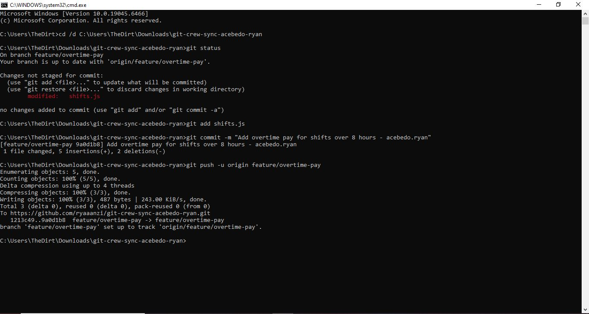
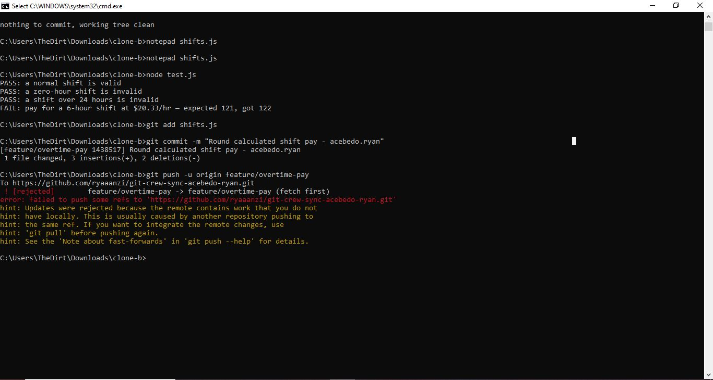
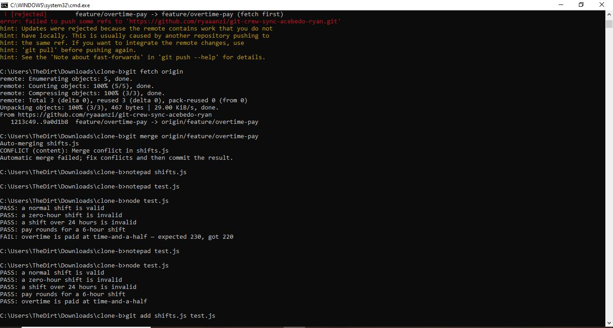
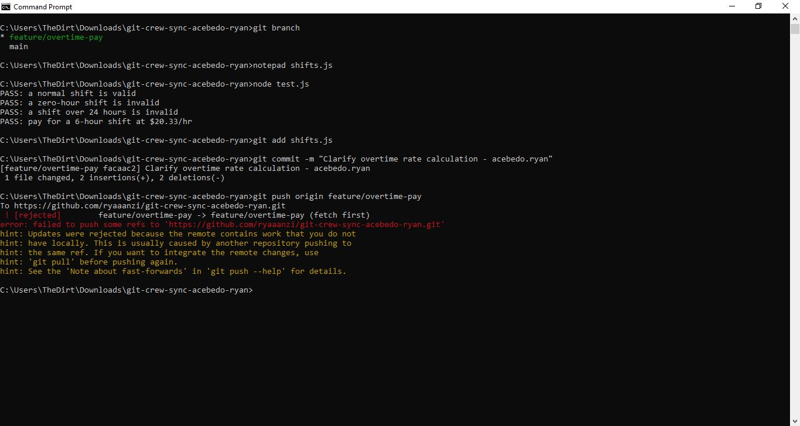
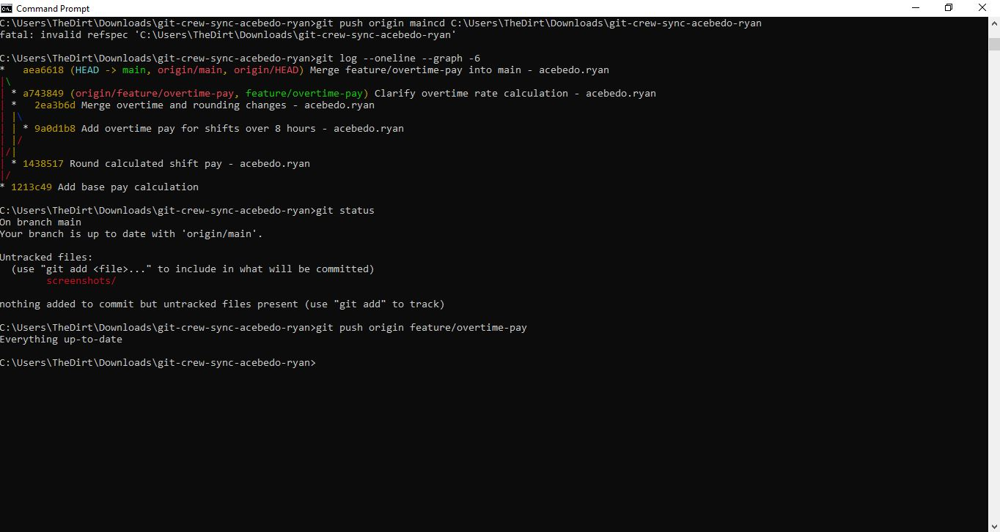
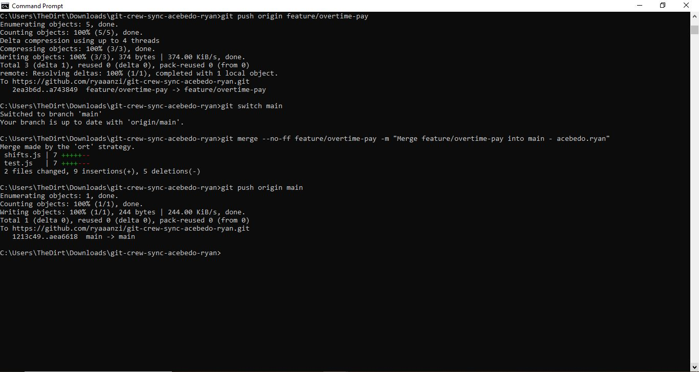

# Crew Sync: Reconciling Divergent Work on the Shift Scheduler Service

**Name:** Ryan Acebedo
**GitHub:** ryaaanzi
**Repository:** git-crew-sync-acebedo-ryan

## Task 1 — Overtime Pay Change (Clone A)

Added time-and-a-half pay for hours worked beyond 8 hours.

## Task 2 — Rejected Push (Clone B)

The push was rejected because Clone B's local branch did not contain the latest remote changes.

## Task 3 — Fetch, Merge, and Resolve Conflict (Clone B)

Fetched the remote changes, merged them, resolved the conflict in `shifts.js`, and verified that all tests passed before pushing.

## Task 4 — Rejected Push and Rebase (Clone A)

Made a new change without fetching first. The push was rejected. Then fetched the remote changes, rebased, resolved the conflict, ran the tests, and pushed successfully.

### Rejected Push

### Rebase Result

## Task 5 — Merge Feature into Main (Clone A)

Merged `feature/overtime-pay` into `main` and pushed the updated main branch to GitHub.

## Reflection Questions

### 1. What does the rejected push message mean, and why did it happen?

It means Git would not allow my local branch to overwrite or move the remote branch backward. It happened because the remote branch had commits that my local branch did not have yet.

### 2. What is the difference between merge and rebase?

Merge combines changes from two branches and usually creates a merge commit, preserving the branch history. Rebase moves my commits so they are replayed on top of another branch, creating a more linear history.

### 3. What habit can help avoid both rejected pushes?

Before starting work or pushing, fetch or pull the latest remote changes, check the branch status, and regularly sync with teammates.

### 4. What is your default approach on a shared team branch, and why?

I would fetch and review the latest changes before working, then integrate them carefully. I would use merge when preserving the shared branch history is important, and avoid force-pushing because it can overwrite teammates' work.
